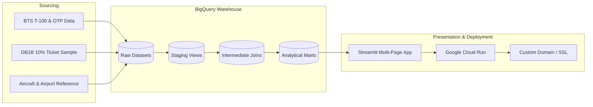

# Project Playbook: AvDB

A master execution roadmap for building the **AvDB** Aviation Analytics Platform & Interactive Streamlit Dashboard powered by Google BigQuery.

---

## Architecture & Data Flow

---

## Milestone Checklist

### Phase 1: Environment & Foundational Setup
- [x] Project architecture and playbook definition.
- [ ] Create Python `.venv` environment and configure `pyproject.toml` / `requirements.txt`.
- [ ] Set up GCP BigQuery dataset schemas (`avdb_raw`, `avdb_analytics`).
- [ ] Configure Docker & local container testing environment (`Dockerfile`, `docker-compose.yml`).

### Phase 2: Ingestion & Pipeline (BTS + DB1B -> BigQuery)
- [x] **2.1 BTS T-100 & DB1B BigQuery Profiling**:
  - [x] Profiled 14.0M rows of T-100 and 40.3M rows of DB1B OD40 in `db1b-1`.
- [x] **2.2 Dimensional Reference Tables & Catchments**:
  - [x] Created `reporting.ref_airports` with 50,409 global and US physical airport coordinates + metro area entries.
  - [x] Created `reporting.ref_city_markets` mapping multi-airport catchment systems (WAS $\rightarrow$ DCA/IAD/BWI, NYC $\rightarrow$ JFK/LGA/EWR, CHI $\rightarrow$ ORD/MDW, etc.).
  - [x] Created `reporting.ref_airport_code_history` tracking historical airport closures, relocations, and code migrations (TXL/SXF $\rightarrow$ BER, PFN $\rightarrow$ ECP, FYV $\rightarrow$ XNA, ISL $\rightarrow$ IST).
  - [ ] Ingest FAA Aircraft Registry / Master Reference (tail number to aircraft type/engine/manufacturer).

### Phase 3: Analytics & Transformation Layer (BigQuery / dbt)
- [x] **3.1 Analytical Marts (`reporting.mart_*`)**:
  - [x] Materialized `reporting.mart_airport_network_summary` (2.52M rows, partitioned by month, clustered by origin, dest, carrier).
  - [x] Materialized `reporting.mart_airline_network_performance` (2.52M rows, ASM, RPM, yields, route market shares).
  - [x] Materialized `reporting.mart_fleet_route_dynamics` (4.04M rows, aircraft families, gauge, stage length).

### Phase 4: Streamlit Interactive Dashboard
- [x] **4.1 Core Framework & Navigation**:
  - [x] Multi-page layout with Apple-inspired minimalist design system and typography.
  - [x] Multi-tier BigQuery cached connection client with smart OAuth token fallback (`app/utils/bq_client.py`).
  - [x] Dynamic visualizers for Great-Circle PyDeck maps, Plotly donuts, and horizontal bar charts (`app/utils/visualizers.py`).
- [x] **4.2 Page 1: ✈️ Airports Explorer**:
  - [x] Top-row KPI cards (Total Passengers, Direct Destinations, Load Factor %, Avg O&D Fare, Top Carrier).
  - [x] Multi-Airport Metropolitan Catchment badges (WAS $\rightarrow$ DCA/IAD/BWI, NYC $\rightarrow$ JFK/LGA/EWR, etc.).
  - [x] Service Type Filter toggle (✈️ Scheduled Passenger Service vs. 📦 All Cargo/Charters).
  - [x] Top 1/3 section: Top Outbound Routes (Bar Chart) + Carrier Capacity Share (Donut) + Fleet Equipment Mix (Aircraft Models Bar Chart).
  - [x] Bottom 2/3: Immersive Great-Circle Arc and Node PyDeck map with custom Mapbox style support & luxury glassmorphism tooltips.
  - [x] Detailed expandable route network data table with formatted metrics.
- [ ] **4.3 Page 2: 🏢 Airlines Explorer**:
  - [ ] Network map & hub-and-spoke vs. point-to-point density.
  - [ ] Fare distribution histograms & yield metrics.
  - [ ] Capacity and load factor trends.
- [ ] **4.4 Page 3: 💺 Fleet & Aircraft Types**:
  - [ ] Aircraft type deployment by route / stage length.
  - [ ] Up-gauging / down-gauging trends over time.
  - [ ] Fleet age & utilization analysis.
- [ ] **4.5 Future Lens: 📦 Cargo & Freight Logistics**:
  - [ ] Dedicated tab for dedicated cargo operators (FedEx, UPS, Atlas Air, Kalitta) and freight tons/mail volume without passenger metric pollution.

### Phase 5: Deployment, Domain & Production Readiness
- [ ] **5.1 Docker Containerization**:
  - [ ] Build and test multi-stage production Docker image.
- [ ] **5.2 Cloud Run Deployment**:
  - [ ] Deploy container to Google Cloud Run with IAM service account for BigQuery read access.
- [ ] **5.3 Custom Domain & SSL**:
  - [ ] Map custom domain (DNS records + managed SSL certificate).
