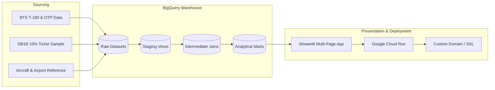

# Project Playbook: AvDB

A master execution roadmap for building the **AvDB** Aviation Analytics Platform & Interactive Streamlit Dashboard powered by Google BigQuery.

---

## Architecture & Data Flow

---

## Milestone Checklist

### Phase 1: Environment & Foundational Setup
- [x] Project architecture and playbook definition.
- [x] Create Python `.venv` environment and configure `pyproject.toml` / `requirements.txt`.
- [x] Set up GCP BigQuery dataset schemas (`avdb_raw`, `avdb_analytics`).
- [ ] Configure Docker & local container testing environment (`Dockerfile`, `docker-compose.yml`).

### Phase 2: Ingestion & Pipeline (BTS + DB1B -> BigQuery)
- [x] **2.1 BTS T-100 & DB1B BigQuery Profiling**:
  - [x] Profiled 14.0M rows of T-100 and 40.3M rows of DB1B OD40 in `db1b-1`.
- [x] **2.2 Dimensional Reference Tables & Catchments**:
  - [x] Created `reporting.ref_airports` with 50,409 global and US physical airport coordinates + metro area entries.
  - [x] Created `reporting.ref_city_markets` mapping multi-airport catchment systems (WAS $\rightarrow$ DCA/IAD/BWI, NYC $\rightarrow$ JFK/LGA/EWR, CHI $\rightarrow$ ORD/MDW, etc.).
  - [x] Created `reporting.ref_airport_code_history` tracking historical airport closures, relocations, and code migrations (TXL/SXF $\rightarrow$ BER, PFN $\rightarrow$ ECP, FYV $\rightarrow$ XNA, ISL $\rightarrow$ IST).
  - [ ] Ingest FAA Aircraft Registry / Master Reference (tail number to aircraft type/engine/manufacturer).

### Phase 3: Analytics & Transformation Layer (BigQuery / dbt)
- [x] **3.1 Analytical Marts (`reporting.mart_*`)**:
  - [x] Materialized `reporting.mart_airport_network_summary` (2.52M rows, partitioned by month, clustered by origin, dest, carrier).
  - [x] Materialized `reporting.mart_airline_network_performance` (2.52M rows, ASM, RPM, yields, route market shares).
  - [x] Materialized `reporting.mart_fleet_route_dynamics` (4.04M rows, aircraft families, gauge, stage length).

### Phase 4: Streamlit Interactive Dashboard
- [x] **4.1 Core Framework & Navigation**:
  - [x] Multi-page layout with Apple-inspired minimalist design system and typography.
  - [x] Multi-tier BigQuery cached connection client with smart OAuth token fallback (`app/utils/bq_client.py`).
  - [x] Dynamic visualizers for Great-Circle PyDeck maps, Plotly donuts, and horizontal bar charts (`app/utils/visualizers.py`).
- [x] **4.2 Page 1: ✈️ Airports Explorer**:
  - [x] Top-row KPI cards (Total Passengers, Direct Destinations, Load Factor %, Avg O&D Fare, Top Carrier).
  - [x] Multi-Airport Metropolitan Catchment badges (WAS $\rightarrow$ DCA/IAD/BWI, NYC $\rightarrow$ JFK/LGA/EWR, etc.).
  - [x] Service Frequency Filter ($\ge 10$ flights/yr default) to filter out 1-off charters (e.g. EUG $\rightarrow$ MAF C5).
  - [x] Plotly Tooltip Fix for multi-line hover cards without raw HTML tags.
  - [x] **Target Destination Proposals**: Unserved 1-stop connecting market analysis, Business vs. Leisure yield tags, and hub-strategy aligned carrier assignments.
  - [x] **Multi-Carrier Route Competition & Fare Premium Matrix**: Head-to-head fare and yield comparisons (e.g. Alaska vs Spirit).
  - [x] **1990s Airline Route Atlas & Cartography**: 2D geodesic great-circle lines hugging the surface (`pitch=0, bearing=0`), fixed-pixel pin nodes, IATA 3-letter typography (`TextLayer`), concentric bullseye origin hub markers (`★ ORD`), fully resolved hub metrics (no `{...}` tokens), and Midnight Navy vs Classic Paper cartographic themes.
- [x] **4.3 Page 2: 🏢 Airlines Explorer**:
  - [x] Top KPI cards (Active Routes, Departures, System Load Factor %, Yield/mile, Avg Fare).
  - [x] **Nationwide Carrier Route Network Atlas**: Full network route visualization in 1990s in-flight style with primary hub markers and carrier signature colorways.
  - [x] Top Hub & Focus City Concentration analysis.
  - [x] Network Yield Curve scatter plot (Stage Length vs Yield $/mile).
  - [x] Hub-aligned strategic expansion proposals.
- [x] **4.4 Page 3: 💺 Fleet & Aircraft Types**:
  - [x] Top KPI cards (Unique Airframes, Operating Carriers, Departures, Avg Gauge, Avg Stage Length).
  - [x] Aircraft model deployment mix by seat capacity and category (Widebody, Mainline, Regional Jet, Turboprop).
  - [x] Gauge vs. Stage Length economics scatter plot.
- [ ] **4.5 Future Lens: 📦 Cargo & Freight Logistics**:
  - [ ] Dedicated tab for dedicated cargo operators (FedEx, UPS, Atlas Air, Kalitta) and freight tons/mail volume without passenger metric pollution.

### Phase 5: Deployment, Domain & Production Readiness
- [x] **5.1 Docker Containerization**:
  - [x] Built and verified production Docker image with gcloud ADC integration.
- [x] **5.2 Cloud Run Deployment**:
  - [x] Deployed container to Google Cloud Run (`us-central1-docker.pkg.dev/db1b-1/avdb/app:latest`) with auto-scaling down to zero ($0 base cost).
- [x] **5.3 Custom Domain, SSL & Security**:
  - [x] Mapped custom domain `avdb.riffe.co.uk` with Google-managed SSL.
  - [x] Google OAuth 2.0 authentication with email allowlist protection (`ALLOWED_EMAILS=steve@riffe.co.uk`).
  - [x] BigQuery cost safeguards (enforced 1 GB maximum bytes billed per query).

---

### Phase 6: Visual Asset Enrichment & Network Alliances
- [x] **6.1 Airline Logos & Tailfin Graphics**:
  - [x] Sourced high-resolution SVG airline brand logos for 60+ global and US airlines in `app/data/ref_alliances.py`.
  - [x] Integrated logos into airline selector, KPI cards, and carrier profiles on Airlines Explorer.
- [x] **6.2 Granular Fleet Graphics & Subfleet Profiles**:
  - [x] Created `app/data/ref_aircraft_specs.py` cataloging technical specifications (range, wingspan, seat density, cruise speed, engines, primary operators) for major fleet families.
  - [x] Integrated visual aircraft specifications and leading operator cards with logos into Fleet Explorer (`app/pages/3_💺_Fleet_Routes.py`).
- [x] **6.3 Historical & Time-Variant Alliance Overlays**:
  - [x] Built `app/data/ref_alliances.py` and `app/data/alliances_history.json` tracking membership timelines (Star Alliance, oneworld, SkyTeam, Wings Alliance, Qualiflyer).
  - [x] Tracked historical shifts over time with verified source citations (e.g. SAS: Star $\rightarrow$ SkyTeam 2024; Aer Lingus: oneworld $\rightarrow$ Independent 2007; Continental: Wings $\rightarrow$ SkyTeam $\rightarrow$ Star; US Airways: Star $\rightarrow$ oneworld).
  - [x] Implemented temporal alliance query engine in `app/utils/alliances.py` with transition timeline expanders.

---

### Phase 7: Personal Travel Lens (Flighty Integration)
- [x] **7.1 Flighty CSV Ingestion & Parser**:
  - [x] Drag-and-drop Flighty export upload in Streamlit UI (`app/pages/4_📱_Flighty_Traveler.py`) with local privacy preservation.
  - [x] Built `app/utils/flighty.py` parsing flight date, origin/destination, carrier, aircraft type, seat, and cabin class.
  - [x] Built one-click "Load Sample Log" realistic 30-flight test dataset for immediate interactive previewing.
- [x] **7.2 Flexible Subfleet & Aircraft Family Grouping**:
  - [x] Built hierarchical subfleet taxonomy engine (Exact Subfleet e.g. 737-900ER vs 737-800 vs MAX 9; Generation e.g. NextGen vs MAX; Family e.g. Boeing 737).
  - [x] Added dynamic subfleet grouping radio toggle and interactive flight volume / air mile share distribution charts.
- [x] **7.3 Personal In-Flight Route Map & BTS Context**:
  - [x] Generated personal 1990s in-flight route map with geodesic curves and flight frequency arc weighting.
  - [x] Integrated custom Mapbox styles and colorways into personal travel visualization.

---

### Phase 8: Native Apple iOS App (SwiftUI & FastAPI)
- [x] **8.1 Backend API Layer**:
  - [x] Built lightweight FastAPI service in `api/` exposing cached JSON endpoints for airports, routes, KPIs, airlines, and fleet summary.
  - [x] Dockerfile and BigQuery wallet safeguards configured for Cloud Run deployment (`api.avdb.riffe.co.uk`).
- [x] **8.2 Native iOS Frontend (SwiftUI)**:
  - [x] Full Swift Package / Xcode project in `ios/AvDB/` targeting iOS 17+ with Apple Liquid Glass aesthetics.
  - [x] 5-tab root navigation: Airports Explorer, Airlines Network, Fleet & Subfleets, Flighty Travel Log, Settings.
  - [x] 120Hz ProMotion Apple MapKit geodesic route map with concentric bullseye hub markers and IATA typography.
  - [x] Native iOS `.fileImporter` for Flighty CSV files with offline parser and lifetime travel KPIs.
  - [x] Comprehensive pairing and deployment guide in `ios/README.md`.

---

### Phase 9: Mergers Tracking, Regional Capacity Attribution & Personal Analytics Expansion
- [x] **9.1 Historical Airline Merger Tracking Engine**:
  - [x] Cataloged 11 major US airline mergers since 1990 in `app/data/ref_mergers.py` (CO $\rightarrow$ UA, NW $\rightarrow$ DL, US $\rightarrow$ AA, HP $\rightarrow$ US, QQ $\rightarrow$ AA, TW $\rightarrow$ AA, FL $\rightarrow$ WN, VX $\rightarrow$ AS, HA $\rightarrow$ AS, YX $\rightarrow$ F9, PA $\rightarrow$ DL).
  - [x] Multi-tier ancestor chain discovery (`get_all_ancestor_codes`) and corporate predecessor resolution in `app/utils/mergers.py`.
  - [x] Merged lineage HTML banners and historical carrier selection in Airlines Explorer.
- [x] **9.2 Regional Airline Capacity Attribution**:
  - [x] Formulated `REGIONAL_ATTRIBUTION_SQL` mapping regional operating certificates (SkyWest `OO`, Horizon `QX`, Endeavor `9E`, Envoy/PSA/Piedmont `MQ`/`OH`/`PT`, CommuteAir/GoJet `C5`/`G7`) to consumer marketing brands (`DL`, `AS`, `UA`, `AA`).
  - [x] Resolved carrier attribution on EUG-SEA in 2025 so Delta (`DL`) and Alaska (`AS`) receive full flight and seat attribution.
- [x] **9.3 Nonstop Route History in Unserved Connecting Markets**:
  - [x] Added `historical_routes` CTE and `enrich_historical_route_service` in `app/utils/queries.py` and `app/utils/mergers.py`.
  - [x] Synthesizes historical service with merger hub heritage (e.g. ANC $\rightarrow$ DTW identified as flown until 2021 by `NW/DL`).
  - [x] Added Prior Nonstop Service History column to Target Destination Proposals in Airports Explorer.
- [x] **9.4 Personal Analytics Dashboard Expansion**:
  - [x] YoY Travel Volume & Air Miles dual-axis trends (`build_flighty_yoy_trends`).
  - [x] Global Alliance Loyalty Breakdown interactive donut (`build_flighty_alliance_donut`).
  - [x] In-Flight Seating Position preference (`build_flighty_seat_preference_donut`: Window vs Aisle vs Middle).
  - [x] Environmental Carbon Footprint ($CO_2$ metric tons, forest tree offsets).
  - [x] Embedded carrier SVG brand logos in Top Carrier KPI and complete flight log.
- [x] **9.5 Fleet Explorer Technical Specs & Operator Breakdown**:
  - [x] Aircraft specification cards (`app/data/ref_aircraft_specs.py`) with typical seats, range, wingspan, engines, and summary.
  - [x] Category operator breakdown with carrier brand logos (`get_fleet_operators_breakdown`).
- [x] **9.6 Xcode Duplicate Module Collision Fix**:
  - [x] Renamed Swift Package target to `AvDBCore` in `ios/AvDB/Package.swift` to resolve Xcode duplicate module build error on iPhone 16 Pro Max / iOS 27 beta.

