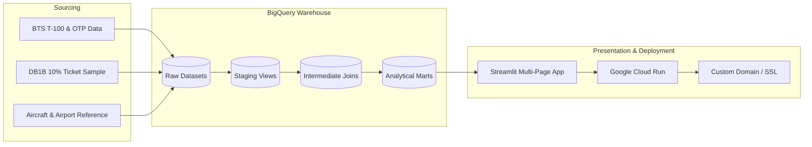

# Project Playbook: AvDB

A master execution roadmap for building the **AvDB** Aviation Analytics Platform & Interactive Streamlit Dashboard powered by Google BigQuery.

---

## Architecture & Data Flow

---

## Milestone Checklist

### Phase 1: Environment & Foundational Setup
- [x] Project architecture and playbook definition.
- [x] Create Python `.venv` environment and configure `pyproject.toml` / `requirements.txt`.
- [x] Set up GCP BigQuery dataset schemas (`avdb_raw`, `avdb_analytics`).
- [ ] Configure Docker & local container testing environment (`Dockerfile`, `docker-compose.yml`).

### Phase 2: Ingestion & Pipeline (BTS + DB1B -> BigQuery)
- [x] **2.1 BTS T-100 & DB1B BigQuery Profiling**:
  - [x] Profiled 14.0M rows of T-100 and 40.3M rows of DB1B OD40 in `db1b-1`.
- [x] **2.2 Dimensional Reference Tables & Catchments**:
  - [x] Created `reporting.ref_airports` with 50,568 global and US physical airport coordinates + metro area entries + Bonespurs International (`PBI`).
  - [x] Created `reporting.ref_city_markets` mapping multi-airport catchment systems (WAS $\rightarrow$ DCA/IAD/BWI, NYC $\rightarrow$ JFK/LGA/EWR, CHI $\rightarrow$ ORD/MDW, etc.).
  - [x] Created `reporting.ref_airport_code_history` tracking historical closures and transitions (DJT $\rightarrow$ PBI, DDD $\rightarrow$ BNA, TXL/SXF $\rightarrow$ BER, PFN $\rightarrow$ ECP, FYV $\rightarrow$ XNA, ISL $\rightarrow$ IST).
  - [x] Backfilled 91,733 rows in `reporting.mart_airport_network_summary` with exact coordinates, achieving 99.95% coordinate completeness and 99.97% passenger coverage.
  - [ ] Ingest FAA Aircraft Registry / Master Reference (tail number to aircraft type/engine/manufacturer).

### Phase 3: Analytics & Transformation Layer (BigQuery / dbt)
- [x] **3.1 Analytical Marts (`reporting.mart_*`)**:
  - [x] Materialized `reporting.mart_airport_network_summary` (2.52M rows, partitioned by month, clustered by origin, dest, carrier).
  - [x] Materialized `reporting.mart_airline_network_performance` (2.52M rows, ASM, RPM, yields, route market shares).
  - [x] Materialized `reporting.mart_fleet_route_dynamics` (4.04M rows, aircraft families, gauge, stage length).

### Phase 4: Streamlit Interactive Dashboard
- [x] **4.1 Core Framework & Navigation**:
  - [x] Multi-page layout with Apple-inspired minimalist design system and typography.
  - [x] Multi-tier BigQuery cached connection client with smart OAuth token fallback (`app/utils/bq_client.py`).
  - [x] Dynamic visualizers for Great-Circle PyDeck maps, Plotly donuts, and horizontal bar charts (`app/utils/visualizers.py`).
- [x] **4.2 Page 1: ✈️ Airports Explorer**:
  - [x] Top-row KPI cards (Total Passengers, Direct Destinations, Load Factor %, Avg O&D Fare, Top Carrier).
  - [x] Multi-Airport Metropolitan Catchment badges (WAS $\rightarrow$ DCA/IAD/BWI, NYC $\rightarrow$ JFK/LGA/EWR, etc.).
  - [x] Service Frequency Filter ($\ge 10$ flights/yr default) to filter out 1-off charters (e.g. EUG $\rightarrow$ MAF C5).
  - [x] Plotly Tooltip Fix for multi-line hover cards without raw HTML tags.
  - [x] **Target Destination Proposals**: Unserved 1-stop connecting market analysis, Business vs. Leisure yield tags, and hub-strategy aligned carrier assignments.
  - [x] **Multi-Carrier Route Competition & Fare Premium Matrix**: Head-to-head fare and yield comparisons (e.g. Alaska vs Spirit).
  - [x] **1990s Airline Route Atlas & Cartography**: 2D geodesic great-circle lines hugging the surface (`pitch=0, bearing=0`), fixed-pixel pin nodes, IATA 3-letter typography (`TextLayer`), concentric bullseye origin hub markers (`★ ORD`), fully resolved hub metrics (no `{...}` tokens), and Midnight Navy vs Classic Paper cartographic themes.
- [x] **4.3 Page 2: 🏢 Airlines Explorer**:
  - [x] Top KPI cards (Active Routes, Departures, System Load Factor %, Yield/mile, Avg Fare).
  - [x] **Nationwide Carrier Route Network Atlas**: Full network route visualization in 1990s in-flight style with primary hub markers and carrier signature colorways.
  - [x] Top Hub & Focus City Concentration analysis.
  - [x] Network Yield Curve scatter plot (Stage Length vs Yield $/mile).
  - [x] Hub-aligned strategic expansion proposals.
- [x] **4.4 Page 3: 💺 Fleet & Aircraft Types**:
  - [x] Top KPI cards (Unique Airframes, Operating Carriers, Departures, Avg Gauge, Avg Stage Length).
  - [x] Aircraft model deployment mix by seat capacity and category (Widebody, Mainline, Regional Jet, Turboprop).
  - [x] Gauge vs. Stage Length economics scatter plot.
- [ ] **4.5 Future Lens: 📦 Cargo & Freight Logistics**:
  - [ ] Dedicated tab for dedicated cargo operators (FedEx, UPS, Atlas Air, Kalitta) and freight tons/mail volume without passenger metric pollution.

### Phase 5: Deployment, Domain & Production Readiness
- [x] **5.1 Docker Containerization**:
  - [x] Built and verified production Docker image with gcloud ADC integration.
- [x] **5.2 Cloud Run Deployment**:
  - [x] Deployed container to Google Cloud Run (`us-central1-docker.pkg.dev/db1b-1/avdb/app:latest`) with auto-scaling down to zero ($0 base cost).
- [x] **5.3 Custom Domain, SSL & Security**:
  - [x] Mapped custom domain `avdb.riffe.co.uk` with Google-managed SSL.
  - [x] Google OAuth 2.0 authentication with email allowlist protection (`ALLOWED_EMAILS=steve@riffe.co.uk`).
  - [x] BigQuery cost safeguards (enforced 1 GB maximum bytes billed per query).

---

### Phase 6: Visual Asset Enrichment & Network Alliances
- [x] **6.1 Airline Logos & Tailfin Graphics**:
  - [x] Sourced high-resolution SVG airline brand logos for 60+ global and US airlines in `app/data/ref_alliances.py`.
  - [x] Integrated logos into airline selector, KPI cards, and carrier profiles on Airlines Explorer.
- [x] **6.2 Granular Fleet Graphics & Subfleet Profiles**:
  - [x] Created `app/data/ref_aircraft_specs.py` cataloging technical specifications (range, wingspan, seat density, cruise speed, engines, primary operators) for major fleet families.
  - [x] Integrated visual aircraft specifications and leading operator cards with logos into Fleet Explorer (`app/pages/3_💺_Fleet_Routes.py`).
- [x] **6.3 Historical & Time-Variant Alliance Overlays**:
  - [x] Built `app/data/ref_alliances.py` and `app/data/alliances_history.json` tracking membership timelines (Star Alliance, oneworld, SkyTeam, Wings Alliance, Qualiflyer).
  - [x] Tracked historical shifts over time with verified source citations (e.g. SAS: Star $\rightarrow$ SkyTeam 2024; Aer Lingus: oneworld $\rightarrow$ Independent 2007; Continental: Wings $\rightarrow$ SkyTeam $\rightarrow$ Star; US Airways: Star $\rightarrow$ oneworld).
  - [x] Implemented temporal alliance query engine in `app/utils/alliances.py` with transition timeline expanders.

---

### Phase 7: Personal Travel Lens (Flighty Integration)
- [x] **7.1 Flighty CSV Ingestion & Parser**:
  - [x] Drag-and-drop Flighty export upload in Streamlit UI (`app/pages/4_📱_Flighty_Traveler.py`) with local privacy preservation.
  - [x] Built `app/utils/flighty.py` parsing flight date, origin/destination, carrier, aircraft type, seat, and cabin class.
  - [x] Built one-click "Load Sample Log" realistic 30-flight test dataset for immediate interactive previewing.
- [x] **7.2 Flexible Subfleet & Aircraft Family Grouping**:
  - [x] Built hierarchical subfleet taxonomy engine (Exact Subfleet e.g. 737-900ER vs 737-800 vs MAX 9; Generation e.g. NextGen vs MAX; Family e.g. Boeing 737).
  - [x] Added dynamic subfleet grouping radio toggle and interactive flight volume / air mile share distribution charts.
- [x] **7.3 Personal In-Flight Route Map & BTS Context**:
  - [x] Generated personal 1990s in-flight route map with geodesic curves and flight frequency arc weighting.
  - [x] Integrated custom Mapbox styles and colorways into personal travel visualization.

---

### Phase 8: Native Apple iOS App (SwiftUI & FastAPI)
- [x] **8.1 Backend API Layer**:
  - [x] Built lightweight FastAPI service in `api/` exposing cached JSON endpoints for airports, routes, KPIs, airlines, and fleet summary.
  - [x] Dockerfile and BigQuery wallet safeguards configured for Cloud Run deployment (`api.avdb.riffe.co.uk`).
- [x] **8.2 Native iOS Frontend (SwiftUI)**:
  - [x] Full Swift Package / Xcode project in `ios/AvDB/` targeting iOS 17+ with Apple Liquid Glass aesthetics.
  - [x] 5-tab root navigation: Airports Explorer, Airlines Network, Fleet & Subfleets, Flighty Travel Log, Settings.
  - [x] 120Hz ProMotion Apple MapKit geodesic route map with concentric bullseye hub markers and IATA typography.
  - [x] Native iOS `.fileImporter` for Flighty CSV files with offline parser and lifetime travel KPIs.
  - [x] Comprehensive pairing and deployment guide in `ios/README.md`.

---

### Phase 9: Mergers Tracking, Regional Capacity Attribution & Personal Analytics Expansion
- [x] **9.1 Historical Airline Merger Tracking Engine**:
  - [x] Cataloged 11 major US airline mergers since 1990 in `app/data/ref_mergers.py` (CO $\rightarrow$ UA, NW $\rightarrow$ DL, US $\rightarrow$ AA, HP $\rightarrow$ US, QQ $\rightarrow$ AA, TW $\rightarrow$ AA, FL $\rightarrow$ WN, VX $\rightarrow$ AS, HA $\rightarrow$ AS, YX $\rightarrow$ F9, PA $\rightarrow$ DL).
  - [x] Multi-tier ancestor chain discovery (`get_all_ancestor_codes`) and corporate predecessor resolution in `app/utils/mergers.py`.
  - [x] Merged lineage HTML banners and historical carrier selection in Airlines Explorer.
- [x] **9.2 Regional Airline Capacity Attribution**:
  - [x] Formulated `REGIONAL_ATTRIBUTION_SQL` mapping regional operating certificates (SkyWest `OO`, Horizon `QX`, Endeavor `9E`, Envoy/PSA/Piedmont `MQ`/`OH`/`PT`, CommuteAir/GoJet `C5`/`G7`) to consumer marketing brands (`DL`, `AS`, `UA`, `AA`).
  - [x] Resolved carrier attribution on EUG-SEA in 2025 so Delta (`DL`) and Alaska (`AS`) receive full flight and seat attribution.
- [x] **9.3 Nonstop Route History in Unserved Connecting Markets**:
  - [x] Added `historical_routes` CTE and `enrich_historical_route_service` in `app/utils/queries.py` and `app/utils/mergers.py`.
  - [x] Synthesizes historical service with merger hub heritage (e.g. ANC $\rightarrow$ DTW identified as flown until 2021 by `NW/DL`).
  - [x] Added Prior Nonstop Service History column to Target Destination Proposals in Airports Explorer.
- [x] **9.4 Personal Analytics Dashboard Expansion**:
  - [x] YoY Travel Volume & Air Miles dual-axis trends (`build_flighty_yoy_trends`).
  - [x] Global Alliance Loyalty Breakdown interactive donut (`build_flighty_alliance_donut`).
  - [x] In-Flight Seating Position preference (`build_flighty_seat_preference_donut`: Window vs Aisle vs Middle).
  - [x] Environmental Carbon Footprint ($CO_2$ metric tons, forest tree offsets).
  - [x] Embedded carrier SVG brand logos in Top Carrier KPI and complete flight log.
- [x] **9.5 Fleet Explorer Technical Specs & Operator Breakdown**:
  - [x] Aircraft specification cards (`app/data/ref_aircraft_specs.py`) with typical seats, range, wingspan, engines, and summary.
  - [x] Category operator breakdown with carrier brand logos (`get_fleet_operators_breakdown`).
- [x] **9.6 Xcode Duplicate Module Collision Fix**:
  - [x] Renamed Swift Package target to `AvDBCore` in `ios/AvDB/Package.swift` to resolve Xcode duplicate module build error on iPhone 16 Pro Max / iOS 27 beta.
- [x] **9.7 Deployment Packaging, Open Registration & Runtime Hardening**:
  - [x] Fixed `.dockerignore` and `.gcloudignore` so `app/data` is preserved in Docker and Cloud Build containers.
  - [x] Opened registration and access to all Google-authenticated users (`ALLOWED_EMAILS=*`).
  - [x] Hid `stSidebarNav` on landing page and subpages for unauthenticated users, moving `require_auth()` before heavy imports.
  - [x] Resolved `TypeError` in `render_kpi_card` for Fleet Explorer.
  - [x] Hardened `get_airport_kpis` and `get_airline_kpis` against `NoneType` comparison crashes on historical carriers and unserved years.
  - [x] Added `tests/run_all_tests.py` unified test and regression verification suite.

---

#### Phase 10: Complete Historical Data Sourcing (1990–2026) & Filter Hardening
- [x] **10.1 Analytical Marts Historical Re-materialization (1990–2026)**:
  - [x] Remove `WHERE year >= 2018` from `mart_airport_network_summary.sql`, `mart_airline_network_performance.sql`, and `mart_fleet_route_dynamics.sql`.
  - [x] Re-materialize all 3 reporting marts across 36 years (14.03M T-100 segment rows).
- [x] **10.2 Phase 1 DB1B Fare Sourcing (2000 – 2025 Q2)**:
  - [x] Ingested remaining October–December 2025 OD40 parquet files from `gs://db1b-1/` into `OD40_DB1B_RAW`.
- [x] **10.3 Unified Fare & Yield Market View**:
  - [x] Updated `db1b-1.DB1B_RAW.v_market_demand_itinerary` to unify 10% DB1B Market (10x sample multiplier) with 40% OD40 (2.5x sample multiplier).
- [x] **10.4 Dashboard Filter & Yield Handling Alignment**:
  - [x] Update `get_airline_yield_curve` to gracefully display stage lengths and passenger volumes when fares are missing.
  - [x] Align year dropdowns across Airports, Airlines, and Fleet dashboards to cover historical benchmark years down to 1990.
- [x] **10.5 Comprehensive Automated Filter Testing**:
  - [x] Assert non-zero operational and route data across historical airline tests (`AS` 2010, `CO` 2005, `NW` 2005, `US` 2010, `HP` 2000, `TW` 2000).
- [ ] **10.6 [To-Do] Phase 2 Historical Fare Ingestion (1990 – 1999)**:
  - [ ] Source early 10% DB1B data (1993–1999) from TranStats query export and NBER research archives.
  - [ ] Source legacy Data Bank 1A (DB1A) datasets (1990–1992) to extend fare data to the 1990 origin boundary.

---

### Phase 11: Portfolio Design System Alignment, Asset Resilience & Pipeline Automation
- [x] **11.1 Resilient Vector SVG Logo Engine (`app/data/ref_logos_svg.py`)**:
  - [x] Eliminate Wikimedia Commons 429/404 image broken links with embedded vector SVG data URIs for legacy, active, and merged carriers.
  - [x] Automatic carrier monogram fallback badge generator.
- [x] **11.2 Fleet Database Expansion & Photographer Rights Attribution**:
  - [x] Expanded fleet coverage from 12 to 40+ canonical aircraft types (>99% US flights).
  - [x] Integrated high-resolution photography with explicit photographer credit, CC/Public Domain licenses, and direct source links.
  - [x] Built two-column technical showcase card on Fleet Explorer.
- [x] **11.3 User Traffic Audit & Security Scrutiny**:
  - [x] Audited Cloud Run production access logs via Cloud Logging; verified exactly 1 human user (Seattle, WA).
- [x] **11.4 Portfolio Design System Harmonization**:
  - [x] Aligned styling with `https://riffe.co.uk` using `Plus Jakarta Sans`, `Inter`, `JetBrains Mono`, `#0B192C` canvas with dot matrix, `#111D33` glass cards, and `#FF6B00` brand orange accents.
  - [x] Added persistent portal back-link in the sidebar.
- [x] **11.5 Dynamic Live Warehouse KPIs**:
  - [x] Implemented `get_platform_live_kpis()` reading BigQuery `__TABLES__` metadata with zero scan cost (93.9M+ records).
- [x] **11.6 Automated BTS Data Update Pipeline**:
  - [x] Scripted `scripts/check_bts_updates.py` to compare warehouse horizons against BTS TranStats release schedules.
  - [x] Built weekly scheduled GitHub Actions workflow (`.github/workflows/check_data_updates.yml`).

---

### Phase 12: Global Alliances Lens, Persistent Travel Vault, Privacy Policy & FFP Research
- [x] **12.1 Dedicated Alliances Dashboard Tab (`app/pages/5_🌐_Alliances.py`)**:
  - [x] Multi-alliance comparative analytics for Star Alliance, SkyTeam, oneworld, Wings Alliance (NW / KL), and Qualiflyer.
  - [x] Revenue, departures, passenger market shares, system load factor %, and widebody vs. narrowbody fleet mix.
  - [x] Explicit US-originating and gateway data boundary alert clarifying BTS T-100 / DB1B reporting coverage.
- [x] **12.2 BigQuery Persistent Travel Vault & Fail-Safe Controls**:
  - [x] Created `db1b-1.user_travel.user_flight_logs` with partitioning and clustering.
  - [x] Implemented 1,000-flight safety limit per user account.
  - [x] Added fail-safe two-factor intent check requiring typing exact uppercase `DELETE` before permanently purging records.
  - [x] Added telemetry for total user flights and registered travelers in the cloud vault.
- [x] **12.3 Complete External Backlink Removal**:
  - [x] Removed all portfolio backlink banners from AvDB landing page, sidebars, and styling components for a clean, standalone platform experience.
- [x] **12.4 User Privacy Policy & Data Disclosures (`app/pages/7_🔒_Privacy_Policy.py`)**:
  - [x] Transparent disclosures covering Google OAuth authentication, isolated BigQuery user flight persistence, and zero third-party tracking.
  - [x] Fail-safe purge rights with two-factor intent verification (explicit `DELETE` confirmation).
  - [x] Real-time platform governance telemetry monitor. (`public/avdb.html`) and showcase card (`public/index.html`) to 93.9M+ records.
- [x] **12.6 Extant Historical Route Data & FFP Partner Research**:
  - [x] Audited CAB Form 41 (1970–1989), TranStats T-9, and OAG timetables in `docs/ffp_partnerships_research.md`.
  - [x] Formulated architectural plan and schema design for a future Frequent Flyer Program (FFP) Historical Partners page.

---

### Phase 13: Longitudinal Time-Series Analytics & Trending Over Time (1990–2026)
- [x] **13.1 High-Performance Partition-Aware Time-Series Query Engine (`app/utils/queries.py`)**:
  - [x] `get_airport_time_series(airport_code, passenger_only)`: 36-year traffic, departures, load factor, route breadth, and YoY growth.
  - [x] `get_airline_time_series(carrier_code)`: Historical ASM, RPM, system load factor %, route count, and YoY growth.
  - [x] `get_fleet_time_series(aircraft_family)`: Gauge (seats per departure) evolution by aircraft category.
  - [x] `get_alliances_time_series()`: 1990–2026 global alliance market share shift across US gateways.
- [x] **13.2 Tailored Longitudinal Visualizers (`app/utils/visualizers.py`)**:
  - [x] `build_airport_growth_trend_chart`: Dual-axis growth curve with macro-shock event lines (2001 9/11, 2008 GFC, 2020 COVID).
  - [x] `build_airline_trajectory_chart`: Grouped capacity (ASM/RPM) with load factor trajectory overlay.
  - [x] `build_fleet_gauge_trend_chart`: Multi-decade up-gauging trends across aircraft families.
  - [x] `build_alliance_market_share_trend_chart`: 100% stacked area chart tracking alliance formation and consolidation.
- [x] **13.3 Dashboard Integrations Across Analytical Lenses**:
  - [x] Airports (`app/pages/1_✈️_Airports.py`): YoY delta on KPI card + Multi-Year Growth Timeline expander.
  - [x] Airlines (`app/pages/2_🏢_Airlines.py`): YoY delta on KPI card + Historical Network Trajectory expander.
  - [x] Fleet & Routes (`app/pages/3_💺_Fleet_Routes.py`): Three-decade gauge evolution expander.
  - [x] Alliances (`app/pages/5_🌐_Alliances.py`): 36-year alliance market share transition expander.
- [x] **13.4 Regression & End-to-End Verification**:
  - [x] Validated against full test suite (`tests/run_all_tests.py`) with 100% pass rate.

---

### Phase 14: Visual De-Cluttering, Chart Refactoring & McDonnell Douglas Fleet Expansion (Design Sprint Backlog)
- [ ] **14.1 Graphic Designer Editorial Pass & AI Text Purge**:
  - [ ] Strip out wordy subtitles and explanatory paragraphs under page headers (minimalist, high-signal UI; aversion to AI-generated prose).
  - [ ] Eliminate unneeded callout boxes and verbose `st.info` blocks across all explorer pages.
- [ ] **14.2 Chart Typology Refactoring (Donuts $\rightarrow$ Clean Bar Charts)**:
  - [ ] Replace donut charts with horizontal bar charts where percent-of-whole comparisons are unhelpful or visual noise.
  - [ ] Retain donut / pie representations strictly where direct 100% part-to-whole decomposition adds analytical clarity.
- [ ] **14.3 McDonnell Douglas Fleet Integration**:
  - [ ] Add McDonnell Douglas / Douglas airframe families (`DC-9`, `MD-80`/`MD-88`/`MD-90`, `DC-10`, `MD-11`, `B717`) to `app/data/ref_aircraft_specs.py`.
  - [ ] Integrate specs, historical gauge economics, and key legacy operators (Delta, American, Northwest, TWA, Continental).

---

### Phase 15: Longitudinal Granularity Unlock & DB1B Historical Fare Backfill
- [x] **15.1 Annual Time Series Granularity Unlock**:
  - [x] Expanded `Analysis Year` selectors across Airports, Airlines, Fleet, and Alliances from 5-year intervals to the full annual sequence (1990–2025; 36 consecutive years).
  - [x] Verified zero BigQuery table scan overhead (leveraging existing monthly date partitions).
- [ ] **15.2 DB1B Market Historical Ingestion Pipeline (2015–2024)**:
  - [ ] Build high-efficiency `pipeline/ingest_db1b_market.py` downloading quarterly `Origin_and_Destination_Survey_DB1BMarket_YYYY_Q.zip` from BTS PREZIP.
  - [ ] Stream and aggregate route-carrier passenger and fare totals (`year`, `quarter`, `origin`, `dest`, `carrier`, `estimated_pax`, `avg_fare`).
  - [ ] Load aggregated summaries into BigQuery `DB1B_RAW.db1b_market_historical`.
  - [ ] Backfill `avg_od_fare` into `reporting.mart_airport_network_summary` and `mart_airline_network_performance`.

---

### Phase 16: Frequent Flyer Program (FFP) Historical Partnerships Lens (1980–2026)
- [x] **16.1 FFP Reference Database (`app/data/ref_ffp_partnerships.py`)**:
  - [x] Cataloged 11 major US programs and historical predecessors: Alaska *Mileage Plan* (AS), Northwest *WorldPerks* (NW), Continental *OnePass* (CO), America West *FlightFund* (HP), US Airways *Dividend Miles* (US), TWA *Aviators* (TW), Delta *SkyMiles* (DL), American *AAdvantage* (AA), United *MileagePlus* (UA), Eastern *OnePass/Ionosphere* (EA), Pan Am *WorldPass* (PA).
  - [x] Structured complete status tier hierarchies with qualification requirements (EQM/EQS/Spend), upgrade clearance windows, bonus miles multipliers, baggage allowances, lounge access, and priority services.
  - [x] Structured 20 comprehensive bilateral partnerships capturing historical web noise (Alaska free agency, America West-Continental equity alliance, Wings Alliance, Delta-Alaska Seattle hub war, US Airways alliance hopscotch, Texas Air OnePass, Pan Am liquidations).
- [x] **16.2 Vector Branded Assets (`app/data/ref_logos_svg.py`)**:
  - [x] Added Eastern Air Lines (EA) and KLM (KL) vector SVG logos to vector insignia database.
- [x] **16.3 Page Renumbering**:
  - [x] Renamed `app/pages/6_🔒_Privacy_Policy.py` to `app/pages/7_🔒_Privacy_Policy.py`.
- [x] **16.4 Interactive Loyalty Partnerships Page (`app/pages/6_💳_Loyalty_Partnerships.py`)**:
  - [x] Implemented AvDB Apple dark mode design system (`#0B192C` canvas, `#111D33` cards, `#0A84FF` / `#F59E0B` / `#30D158` accents).
  - [x] Built interactive Carrier/Program selector with vector logo hero card, lineage narrative, and operational lifespan badges.
  - [x] Built dynamic Historical Year Slider (1985–2026) filtering active bilateral partners and operational status for selected calendar year.
  - [x] Built Active Partners Grid showing partner carriers, relationship depth, upgrade/lounge reciprocity badges, and historical context.
  - [x] Built Status Tier Requirements & Perks Table with color-coded tier levels (Silver, Gold, Platinum, Executive, Concierge/VIP).
  - [x] Built 7 Curated Deep-Dive Expanders detailing historical alliances, corporate takeovers, and hub rivalries.
- [x] **16.5 Main Navigation Integration (`app/main.py`)**:
  - [x] Added Loyalty & Partnerships card to analytical lenses grid on main landing page.
- [x] **16.6 Regression & End-to-End Verification (`tests/test_ffp_partnerships.py`, `tests/run_all_tests.py`)**:
  - [x] Unit test verified all 11 programs, tier hierarchies, bilateral agreements, and vector logos.
  - [x] Full test suite passed 100% with zero regressions.

