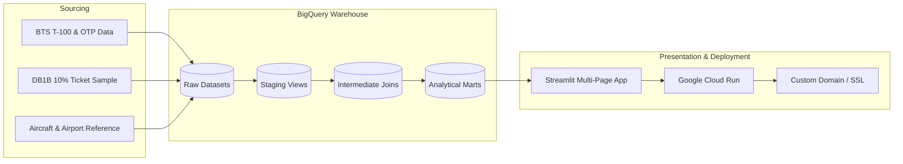

# Project Playbook: AvDB

A master execution roadmap for building the **AvDB** Aviation Analytics Platform & Interactive Streamlit Dashboard powered by Google BigQuery.

---

## Architecture & Data Flow

---

## Milestone Checklist

### Phase 1: Environment & Foundational Setup
- [x] Project architecture and playbook definition.
- [ ] Create Python `.venv` environment and configure `pyproject.toml` / `requirements.txt`.
- [ ] Set up GCP BigQuery dataset schemas (`avdb_raw`, `avdb_analytics`).
- [ ] Configure Docker & local container testing environment (`Dockerfile`, `docker-compose.yml`).

### Phase 2: Ingestion & Pipeline (BTS + DB1B -> BigQuery)
- [ ] **2.1 BTS T-100 Data Pipeline**:
  - [ ] Automated download scripts for T-100 domestic segment & market tables.
  - [ ] Ingestion script to BigQuery (`raw_t100_segments`, `raw_t100_market`).
- [ ] **2.2 DB1B 10% Ticket Survey Pipeline**:
  - [ ] Download & uncompress quarterly DB1B Market, Coupon, and Ticket files.
  - [ ] Schema validation and batch upload into BigQuery (`raw_db1b_coupon`, `raw_db1b_market`, `raw_db1b_ticket`).
- [ ] **2.3 Dimensional Reference Tables**:
  - [ ] Ingest FAA Aircraft Registry / Master Reference (tail number to aircraft type/engine/manufacturer).
  - [ ] Ingest Master Airport Coordinates & Metropolitan Area mappings (IATA/ICAO, lat/lon, city).

### Phase 3: Analytics & Transformation Layer (BigQuery / dbt)
- [ ] **3.1 Staging Models (`stg_`)**:
  - [ ] Standardize airport codes, carrier codes, and timestamp formats.
  - [ ] Clean and filter invalid/extreme DB1B ticket fare outliers.
- [ ] **3.2 Intermediate Models (`int_`)**:
  - [ ] Combine segment loads (T-100) with fare yields (DB1B).
  - [ ] Join aircraft registration data to flight segment records for equipment mapping.
- [ ] **3.3 Analytical Marts (`mart_`)**:
  - [ ] `mart_airport_routes_summary`: Passenger volume, capacity, new routes, carrier mix by airport.
  - [ ] `mart_airline_network_performance`: Route networks, market share, load factor, yield per RPM.
  - [ ] `mart_fleet_route_dynamics`: Aircraft type utilization, gauge trends (seats/dep), stage-length profiles.

### Phase 4: Streamlit Interactive Dashboard
- [ ] **4.1 Core Framework & Navigation**:
  - [ ] Multi-page layout with modern `st.navigation`.
  - [ ] Cached BigQuery connection client (`app/utils/bq_client.py`).
  - [ ] Shared UI theme, sidebar filters (year, quarter, carrier, airport, aircraft family).
- [ ] **4.2 Page 1: ✈️ Airports Explorer**:
  - [ ] Interactive route map (PyDeck great-circle arcs).
  - [ ] New route additions/drops detector over time.
  - [ ] Carrier share breakdown & average O&D fares.
- [ ] **4.3 Page 2: 🏢 Airlines Explorer**:
  - [ ] Network map & hub-and-spoke vs. point-to-point density.
  - [ ] Fare distribution histograms & yield metrics.
  - [ ] Capacity and load factor trends.
- [ ] **4.4 Page 3: 💺 Fleet & Aircraft Types**:
  - [ ] Aircraft type deployment by route / stage length.
  - [ ] Up-gauging / down-gauging trends over time.
  - [ ] Fleet age & utilization analysis.

### Phase 5: Deployment, Domain & Production Readiness
- [ ] **5.1 Docker Containerization**:
  - [ ] Build and test multi-stage production Docker image.
- [ ] **5.2 Cloud Run Deployment**:
  - [ ] Deploy container to Google Cloud Run with IAM service account for BigQuery read access.
- [ ] **5.3 Custom Domain & SSL**:
  - [ ] Map custom domain (DNS records + managed SSL certificate).
